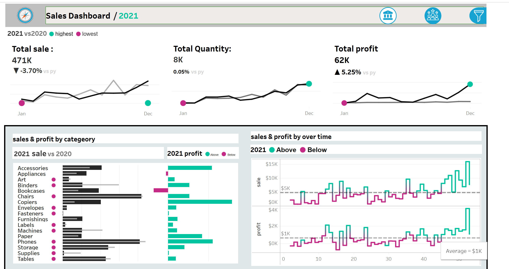

 
# Sales and Customer Dashboard  

## **Introduction**  
This Tableau project combines **Sales Dashboard** and **Customer Dashboard** into a single interactive dashboard. Users can easily switch between the two views to analyze sales performance and customer behavior seamlessly. This integration allows executives, marketers, and managers to derive actionable insights from both sales metrics and customer trends, improving decision-making across the business.  

---

## **Key Features**  

### **1. Sales Dashboard Features**  
  

The **Sales Dashboard** provides an overview of key sales metrics and trends to analyze **year-over-year performance** and identify **sales patterns**. It helps track growth, monitor trends, and support data-driven decision-making for improved sales strategies.  

- **KPI Overview**:  
  - Summarizes total sales, profits, and quantities for the current and previous years.  
  - Allows year-over-year comparisons to track business growth.  

- **Sales Trends Analysis**:  
  - Monthly trends help identify high and low-performing months.  
  - Dynamic filters enable users to explore specific time frames.  

- **Product Subcategory Comparison**:  
  - Compares sales and profit performance across product subcategories.  
  - Highlights profitable and underperforming categories with visual cues.  

- **Weekly Trends for Sales and Profit**:  
  - Visualizes weekly sales and profit data with average benchmarks.  
  - Highlights outliers to identify weeks with unusual performance.  

---

### **2. Customer Dashboard Features** 

The **Customer Dashboard** provides a clear view of customer data, trends, and behaviors, helping businesses understand their audience better. It enables marketing teams and management to identify key customer segments and track engagement. With these insights, companies can enhance customer satisfaction and build stronger relationships.  

- **KPI Overview**:  
  - Displays the total number of customers, total sales per customer, and total orders for both current and previous years.  
  - Provides an at-a-glance view of customer activity.  

- **Customer Trends Visualization**:  
  - Shows monthly trends for customer activity, including sales, orders, and customer counts.  
  - Identifies high and low-performing months for customer engagement.  

- **Customer Distribution by Orders**:  
  - Segments customers based on the number of orders placed.  
  - Visualizes patterns in customer loyalty and engagement.  

- **Top 10 Customers by Profit**:  
  - Ranks the top 10 profit-generating customers with metrics like sales, profit, order count, and last order date.  
  - Helps identify and focus on high-value customers.  

---

## **Unique Features of the Combined Dashboard**  

- **Integrated Views**:  
  - A navigation button allows users to switch between the Sales Dashboard and Customer Dashboard effortlessly.  
  - Users can analyze both sales and customer data without leaving the interface.  

- **Interactive Filters**:  
  - Filters are applied dynamically across both dashboards for seamless exploration of specific years, months, or product categories.  

- **Unified Design**:  
  - Both dashboards share a consistent layout and design for easy navigation and a better user experience.  

---

## **Purpose**  
This combined dashboard provides a comprehensive platform to:  
- Analyze sales performance and customer behavior in one place.  
- Switch between sales and customer insights for better strategic alignment.  
- Help stakeholders make data-driven decisions quickly and efficiently.  

---

## **Data Sources**  
- **Sales Data**: Historical transaction data for tracking sales, profits, and product performance.  
- **Customer Data**: Customer transaction data for trend analysis and segmentation.  

---

## **How to Use the Dashboard**  

1. **Navigate Between Views**:  
   - Use the switch button to toggle between Sales and Customer dashboards.  

2. **Analyze Sales Performance**:  
   - Explore KPIs, trends, product comparisons, and weekly sales data.  

3. **Understand Customer Behavior**:  
   - Examine KPIs, monthly trends, customer distribution, and the top 10 customers by profit.  

4. **Interactive Exploration**:  
   - Apply filters to focus on specific years, product subcategories, or customer segments.  

---

## **Explore the Dashboard**  
**[Sales & Customer Dashboard on Tableau Public](https://public.tableau.com/app/profile/payal.dhameliya/viz/sales_dashboard_V1_0/salesdashboard)**

---
